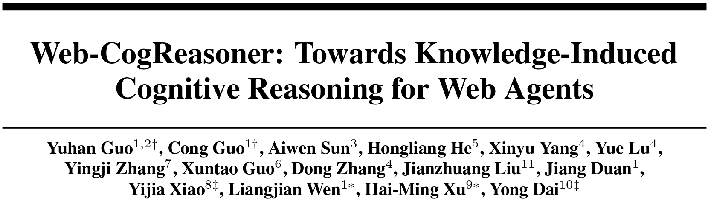
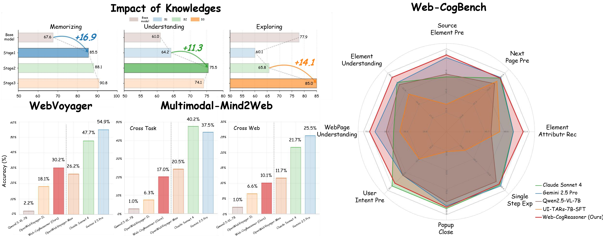

<div align="center">



<p align="center">
    &nbsp;&nbsp; 📑 <a href="https://arxiv.org/abs/2508.01858">arXiv</a> &nbsp;&nbsp;
    | &nbsp;&nbsp; 🤗 <a href="https://huggingface.co/Gnonymous/Web-CogReasoner">Models(Coming soon)</a> &nbsp;&nbsp;
    | &nbsp;&nbsp; 🤗 <a href="https://huggingface.co/datasets/Gnonymous/Web-CogDataset">Dataset(Coming soon)</a> &nbsp;&nbsp;
    | &nbsp;&nbsp; 🤗 <a href="https://github.com/Gnonymous/Web-CogReasoner">Bench(Coming soon)</a> &nbsp;&nbsp;
</p>
<p align="center">
    &nbsp;&nbsp; 🌐 <a href="https://Gnonymous.github.io/Web-CogReasoner">Homepage</a> &nbsp;&nbsp;
    | &nbsp;&nbsp; 💬 <a href="https://Gnonymous.github.io/Web-CogReasoner">Blog</a> &nbsp;&nbsp;
</p>

[](https://arxiv.org/abs/2508.01858)
[](https://huggingface.co/collections/Gnonymous/web-cogreasoner-68932814ffe40e62f35602dd)
[](https://github.com/Gnonymous/Web-CogReasoner/issues)
[](https://github.com/Gnonymous/Web-CogReasoner)

</div>


**Web-CogReasoner** introduces a paradigm shift from simply enhancing web agents to systematically building their cognitive abilities from the ground up. Inspired by Bloom’s Taxonomy, we decomposes agent capabilities into knowledge content learning (Factual, Conceptual) and cognitive processes (Procedural), enabling interpretable and goal-directed behavior. Built upon large multimodal models, it performs knowledge-driven Chain-of-Thought (CoT) reasoning across complex web tasks, where each reasoning step is transparently grounded in a specific knowledge type, ensuring both interpretability and robust generalization.


**To support this, we introduce:**

- **Web-CogKnowledge Framework**: A Bloom's Taxonomy-inspired two-stage training paradigm (Knowledge Content Learning → Cognitive Reasoning) for enhancing web agents' cognitive abilities.

- **Web-CogReasoner**: A knowledge-driven multimodal agent trained via imitation learning in our Web-CogDataset.

- **Web-CogDataset**: A curriculum-style dataset with 12 fine-grained tasks across 3 knowledge levels (Factual, Conceptual, Procedural), enabling stepwise skill acquisition.

- **Web-CogBench**: A dedicated benchmark for evaluating whether a web agent possesses the requisite prior knowledge and cognitive capabilities for effective web navigation.



## To-Do List  
> **Last Updated**: 2025-08-05 13:08 UTC+8

- [x] ~~**Paper**: Release the full research paper on [arXiv](https://arxiv.org/abs/2508.01858).~~
- [ ] **Code**: Open-source the complete code for training and inference. 
- [ ] **Model**: Publish the official Web-CogReasoner model weights.  
- [ ] **Dataset**: Make the Web-CogDataset publicly available for community research.  
- [ ] **Benchmark**: Launch a public online evaluation server for Web-CogBench to ensure fair comparisons.

## News

```
[2025-08-05] Release the full research paper on arXiv.
```


## Performance

**Cognitive & Visual Benchmarks**

This comparison highlights our model's strength in reasoning, a crucial capability that visual-centric models may lack.

| Model | Web-CogBench (Cognition) | VisualWebBench (Vision) |
| :--- | :---: | :---: |
| **_Proprietary Models_** |
| Claude Sonnet 4 | 76.8% | 85.9% |
| Gemini 2.5 Pro | 80.2% | 86.6% |
| **_Open-Source Models_** |
| [Qwen2.5-VL-7B](https://github.com/QwenLM/Qwen2.5-VL) | 69.8% | 76.0% |
| [UI-TARS-7B-SFT](https://github.com/bytedance/UI-TARS/) | 46.4% | 86.0% |
| **Web-CogReasoner (Ours)** | **82.9%** | **86.3%** |

> **Key Insight:** While some models like `UI-TARS` excel at visual tasks (`VisualWebBench`: 86.0%), they struggle with reasoning-intensive tasks (`Web-CogBench`: 48.2%). This highlights that strong visual perception does not guarantee advanced cognitive capabilities—a gap our work aims to fill.

**Online Web Task**

This section evaluates the models' ability to perform complex, multi-step tasks in live web environments.

| Model | WebVoyager (Generalization) | Mind2Web (Cross-task) | Mind2Web (Cross-web) |
| :--- | :---: | :---: | :---: |
| **_Proprietary Models_** |
| Claude Sonnet 4 | 47.7% | 40.2% | 21.7% |
| Gemini 2.5 Pro | 54.9% | 37.5% | 25.5% |
| **_Open-Source Models_** |
| [Qwen2.5-VL-7B](https://github.com/QwenLM/Qwen2.5-VL) | 2.2% | 1.0% | 1.0% |
| [OpenWebVoyager<sub>IL</sub>](https://github.com/minorjerry/openwebvoyager) | 18.1% | 6.3% | 6.6% |
| **Web-CogReasoner (Ours)** | **30.2%** | **17.0%** | **10.1%** |

## Quickstart
*Coming soon*

## Citation

```bibtex
@misc{guo2025webcogreasonerknowledgeinducedcognitivereasoning,
      title={Web-CogReasoner: Towards Knowledge-Induced Cognitive Reasoning for Web Agents}, 
      author={Yuhan Guo and Cong Guo and Aiwen Sun and Hongliang He and Xinyu Yang and Yue Lu and Yingji Zhang and Xuntao Guo and Dong Zhang and Jianzhuang Liu and Jiang Duan and Yijia Xiao and Liangjian Wen and Hai-Ming Xu and Yong Dai},
      year={2025},
      eprint={2508.01858},
      archivePrefix={arXiv},
      primaryClass={cs.CL},
      url={https://arxiv.org/abs/2508.01858}, 
}
```

