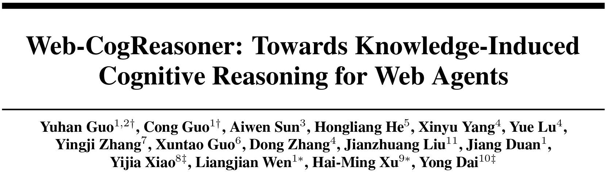
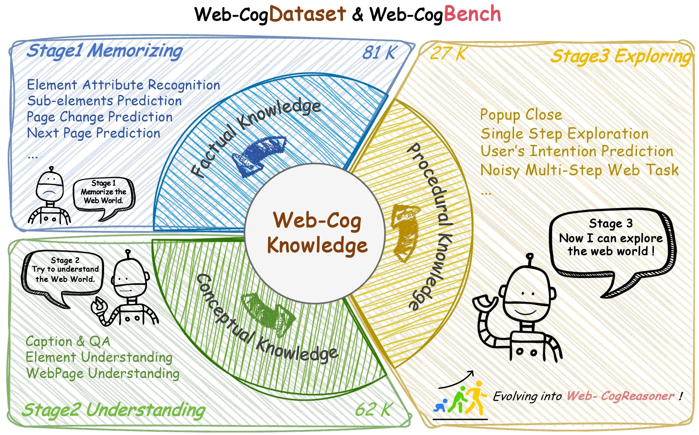
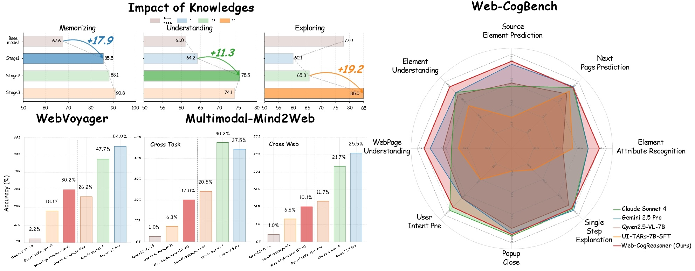

<div align="center">



<p align="center">
    &nbsp;&nbsp; 📑 <a href="https://arxiv.org/abs/2508.01858">ICLR 2026</a> &nbsp;&nbsp;
    | &nbsp;&nbsp; 🤗 <a href="https://huggingface.co/Gnonymous/Web-CogReasoner">Model</a> &nbsp;&nbsp;
    | &nbsp;&nbsp; 🤗 <a href="https://huggingface.co/datasets/Gnonymous/Web-CogDataset">Dataset</a> &nbsp;&nbsp;
    | &nbsp;&nbsp; 🤗 <a href="https://huggingface.co/datasets/Gnonymous/Web-CogBench">Benchmark</a> &nbsp;&nbsp;
</p>
<p align="center">
    &nbsp;&nbsp; 🌐 <a href="https://Gnonymous.github.io/Web-CogReasoner">Homepage</a> &nbsp;&nbsp;
    | &nbsp;&nbsp; 💬 <a href="https://Gnonymous.github.io/blogs/Web-CogReasoner">Blog</a> &nbsp;&nbsp;
</p>

[](https://arxiv.org/abs/2508.01858)
[](https://huggingface.co/collections/Gnonymous/web-cogreasoner-68932814ffe40e62f35602dd)
[](https://github.com/Gnonymous/Web-CogReasoner/issues)
[](https://github.com/Gnonymous/Web-CogReasoner)

</div>



**Web-CogReasoner** introduces a paradigm shift from simply enhancing web agents to systematically building their cognitive abilities from the ground up. Inspired by Bloom’s Taxonomy, we decomposes agent capabilities into knowledge content learning (Factual, Conceptual) and cognitive processes (Procedural), enabling interpretable and goal-directed behavior. Built upon large multimodal models, it performs knowledge-driven Chain-of-Thought (CoT) reasoning across complex web tasks, where each reasoning step is transparently grounded in a specific knowledge type, ensuring both interpretability and robust generalization.


**To support this, we introduce:**

- **Web-CogKnowledge Framework**: A Bloom's Taxonomy-inspired two-stage training paradigm (Knowledge Content Learning → Cognitive Reasoning) for enhancing web agents' cognitive abilities.

- **Web-CogReasoner**: A knowledge-driven multimodal agent trained via imitation learning in our Web-CogDataset.

- **Web-CogDataset**: A curriculum-style dataset with 12 fine-grained tasks across 3 knowledge levels (Factual, Conceptual, Procedural), enabling stepwise skill acquisition.

- **Web-CogBench**: A dedicated benchmark for evaluating whether a web agent possesses the requisite prior knowledge and cognitive capabilities for effective web navigation.



## News

```
[2025-08-05] Release the full research paper on arXiv.
[2026-01-26] 🎉 Our paper has been accepted to ICLR 2026!
```

## To-Do List  
> **Last Updated**: 2025-08-05 13:08 UTC+8

- [x] ~~**Paper**: Release the full research paper on [arXiv](https://arxiv.org/abs/2508.01858).~~
- [x] ~~**Code**: Open-source the complete code for training and inference.~~
- [x] ~~**Model**: Publish the official Web-CogReasoner model weights.~~
- [x] ~~**Dataset**: Make the Web-CogDataset publicly available for community research.~~
- [x] ~~**Benchmark**: Publish Web-CogBench.~~

## Performance

**Cognitive & Visual Benchmarks**

This comparison highlights our model's strength in reasoning, a crucial capability that visual-centric models may lack.

| Model | Web-CogBench (Cognition) | VisualWebBench (Vision) |
| :--- | :---: | :---: |
| **_Proprietary Models_** |
| Claude Sonnet 4 | 76.8% | 85.9% |
| Gemini 2.5 Pro | 80.2% | 86.6% |
| **_Open-Source Models_** |
| [Qwen2.5-VL-7B](https://github.com/QwenLM/Qwen2.5-VL) | 69.8% | 76.0% |
| [UI-TARS-7B-SFT](https://github.com/bytedance/UI-TARS/) | 46.4% | 86.0% |
| **Web-CogReasoner (Ours)** | **82.9%** | **86.3%** |

> **Key Insight:** While some models like `UI-TARS` excel at visual tasks (`VisualWebBench`: 86.0%), they struggle with reasoning-intensive tasks (`Web-CogBench`: 48.2%). This highlights that strong visual perception does not guarantee advanced cognitive capabilities—a gap our work aims to fill.

**Online Web Task**

This section evaluates the models' ability to perform complex, multi-step tasks in live web environments.

| Model | WebVoyager (Generalization) | Mind2Web (Cross-task) | Mind2Web (Cross-web) |
| :--- | :---: | :---: | :---: |
| **_Proprietary Models_** |
| Claude Sonnet 4 | 47.7% | 40.2% | 21.7% |
| Gemini 2.5 Pro | 54.9% | 37.5% | 25.5% |
| **_Open-Source Models_** |
| [Qwen2.5-VL-7B](https://github.com/QwenLM/Qwen2.5-VL) | 2.2% | 1.0% | 1.0% |
| [OpenWebVoyager<sub>IL</sub>](https://github.com/minorjerry/openwebvoyager) | 18.1% | 6.3% | 6.6% |
| **Web-CogReasoner (Ours)** | **30.2%** | **17.0%** | **10.1%** |

## Quickstart

Prepare your own Python environment, download the public assets from the Hugging Face links above into `data/` and `benchmark/`, and serve the model through an OpenAI-compatible endpoint (the scripts default to `http://localhost:8080/v1`). Then run the existing entry points:

```bash
# Training
./scripts/train.sh stage1
./scripts/train.sh stage2
./scripts/train.sh stage3

# Offline evaluation
./scripts/Evaluate_Web-CogBench.sh --mode inference
./scripts/Evaluate_VisualWebBench.sh

# Online exploration and evaluation
./scripts/run.sh
GEMINI_API_KEY=... ./scripts/Evaluate_WebVoyager.sh
```

Use `MODEL_ENDPOINT` to override the local inference endpoint and `GEMINI_API_KEY` for Gemini-based evaluation. Training stages keep the paper's datasets, hyperparameters, and checkpoint chain; paths can be overridden with the options shown by `./scripts/train.sh --help`.

## Tested Environment

The following environment was detected on the current machine:

- OS: Ubuntu 20.04.5 LTS (Focal Fossa)
- Kernel: Linux 3.10.0-1160.el7.x86_64
- Python: 3.8.13
- pip: 25.0.1
- Google Chrome: 137.0.7151.55
- ChromeDriver: 137.0.7151.55

## Citation

```bibtex
@article{guo2025web,
title={Web-CogReasoner: Towards Knowledge-Induced Cognitive Reasoning for Web Agents},
author={Guo, Yuhan and Guo, Cong and Sun, Aiwen and He, Hongliang and Yang, Xinyu and Lu, Yue and Zhang, Yingji and Guo, Xuntao and Zhang, Dong and Liu, Jianzhuang and others},
journal={arXiv preprint arXiv:2508.01858},
year={2025}
}
```
